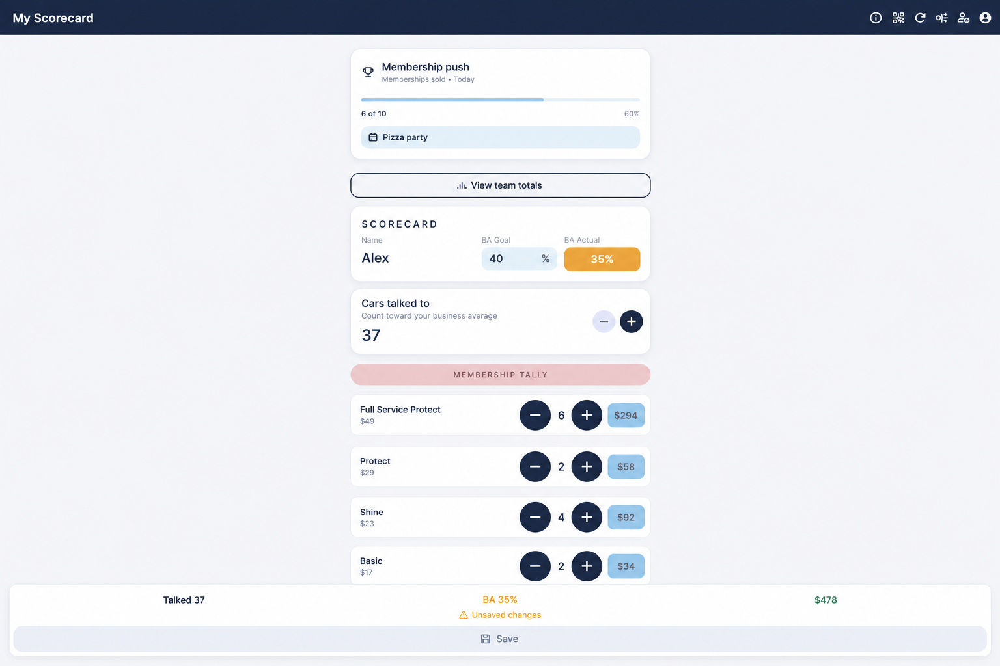
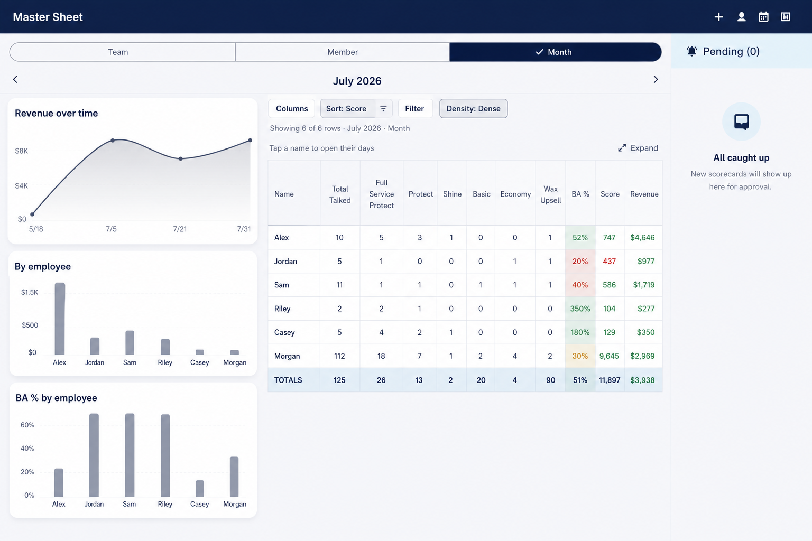
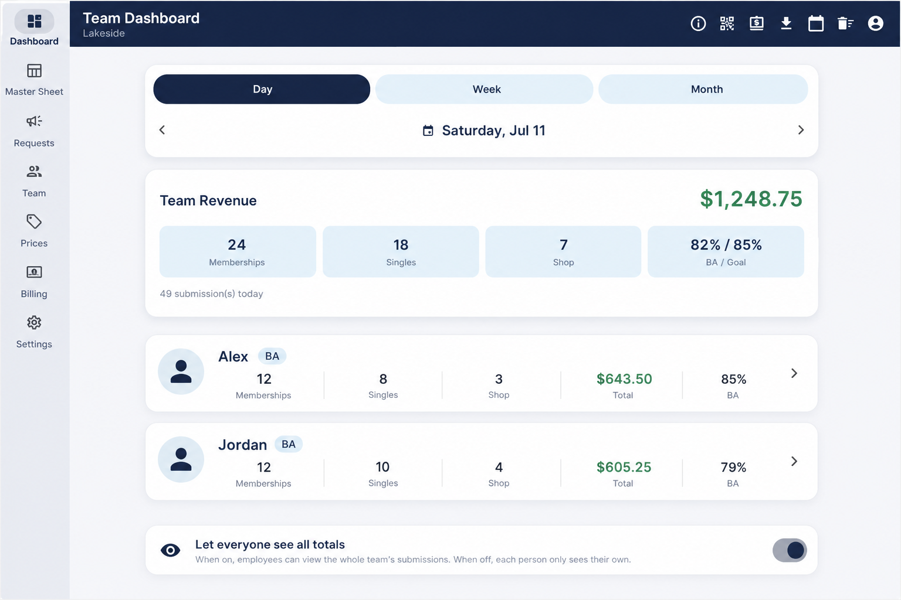
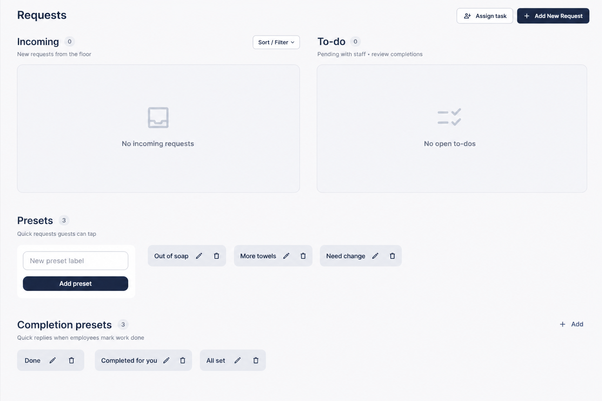

# Wiggy Wash

Flutter web SaaS for multi-location car washes — employee sales scorecards, live manager dashboards, and seat-based billing.

**Live demo:** [aheiner2001.github.io/wiggywash_beta](https://aheiner2001.github.io/wiggywash_beta/)

---

## Screenshots

### Employee scorecard


Shift tallies, BA goal vs actual, membership and wash line items, live totals.

### Master Sheet


Manager analytics: trends, per-employee breakdown, spreadsheet-style history.

### Team Dashboard


Live team revenue and per-employee submission cards for the selected day.

### Requests


Floor asks, assignable to-dos, and preset chips for fast ops communication.

---

## Built with

- **Flutter web (PWA)** — one codebase for phone and desktop
- **Firebase Authentication** — Google sign-in for managers and platform admins
- **Cloud Firestore** — multi-tenant data model (`companies` → `locations` → submissions, roster, config)
- **Firestore security rules** — role-based access and per-location read-only entitlement gates
- **Cloud Functions** — server-side Stripe Checkout, Customer Portal, and webhooks
- **Stripe** — quarterly location-seat subscriptions (quantity = paid sites; comps supported)

### Architecture at a glance

Parent companies buy **location seats**. Each site is `active`, `trial`, `comp`, or `read_only`. Employees use a sticky browser session (company code → scorecard); managers use Google. Writes are blocked when a location is read-only (UI + Store + rules). Stripe webhooks sync `purchasedSeats` into Firestore.

---

## What I built

- Multi-tenant SaaS tenancy (company approval, locations, manager invites)
- Employee sticky login vs manager Google auth
- Scorecard tallies, team dashboard, Master Sheet + trends
- Staff requests / task workflow with presets
- Seat billing, comps, Stripe Checkout + Customer Portal + webhooks

---

## Run locally

```bash
flutter pub get
flutter run -d chrome
```

## Build web

```bash
flutter build web --release --base-href "/wiggywash_beta/"
```

Output: `build/web/`.

## Deploy

GitHub Pages is configured via `.github/workflows/deploy-pages.yml` (builds on push to `mybranch` / `main`).

Firebase project: Firestore + Auth + Functions for billing (`functions/`).

---

## Project layout

```
lib/
  models/      company, location, submission, scorecard config, …
  services/    store.dart (auth, tenancy, entitlements, Stripe callables)
  screens/     scorecard, manager shell, master sheet, billing, …
  widgets/     shared UI
functions/     Stripe Checkout, Portal, webhook
docs/portfolio/  README screenshots
```
